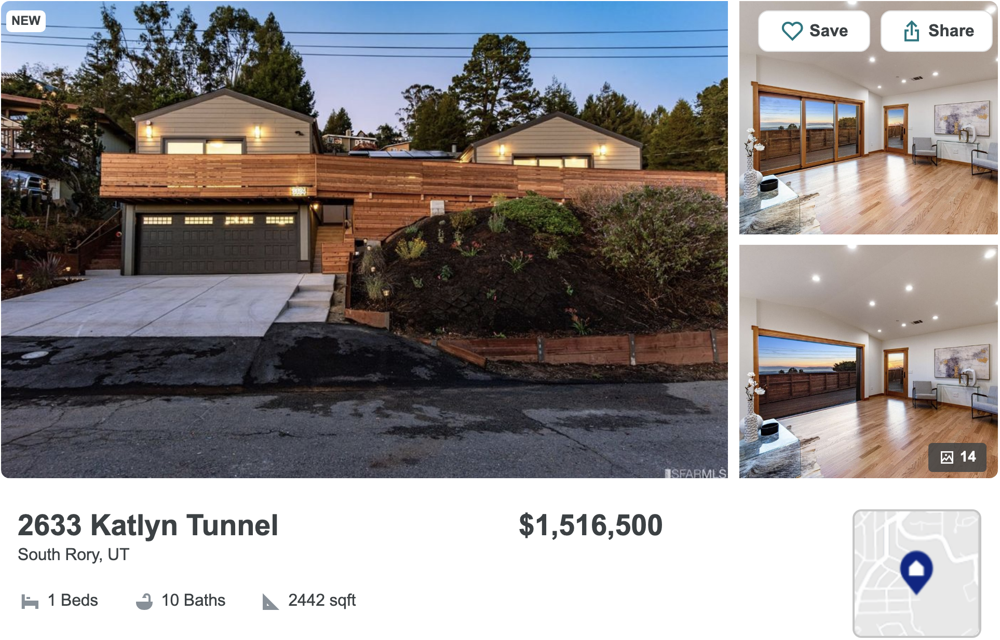

# Photo Gallery Service


####In action: 


## Table of Contents

- [Product Details](#product-details)
- [Usage](#usage)
- [Requirements](#requirements)


## **Product Details**
<a name="product-details"/>
Interactive photo gallery which displays all home images. Reference images sourced through Trulia's home pages. Front end developed using React, React styled-components, Node and Express. Tested via Enzyme, ESLint, Jest, FakerJS and Express.

## Usage
<a name="usage"/>
From within the root directory:

Install dependencies: 
```sh
npm install -g webpack
npm install
```
Start service:

```sh
npm run docker-start
```

## **Requirements**

- Node (6.13.0 or later)
- Mongo (4.4.3 or later)

[Product details]:"product-details"
